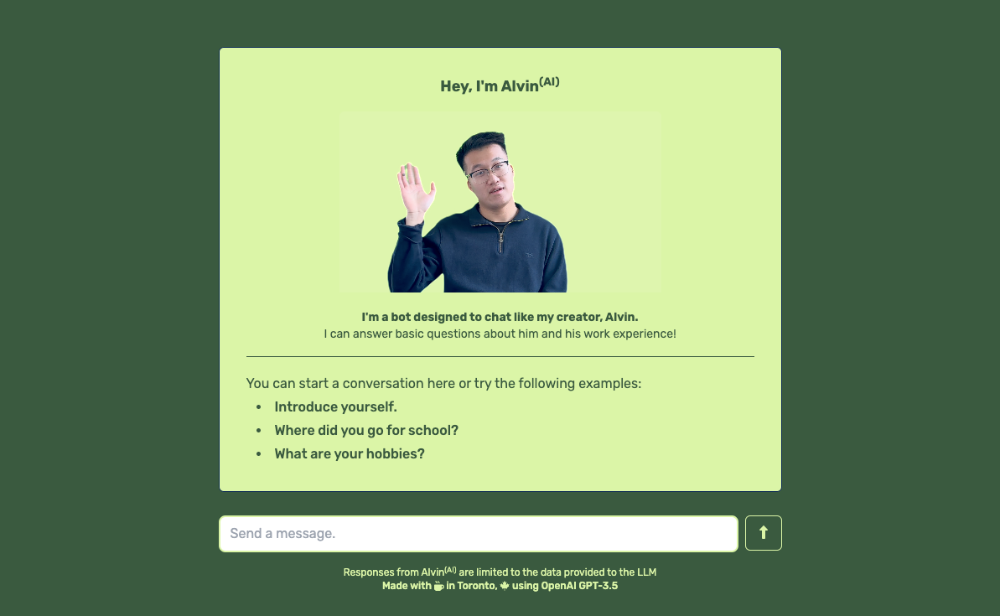

  

    <em>Chat with an AI version of me, Alvin.</em>

---

**Live Demo**: <a href="https://chat.alvintang.me/" target="_blank">https://chat.alvintang.me</a>

**Used**: OpenAI GPT and Embedding Models, LangChain, LangServe

---

This project is a POC for an AI bot designed to chat like me, Alvin. It can answer very basic questions about me and my work experience! It also has the ability to answer questions with the previous chat history in mind.

## Deployment

Follow the following steps to deploy.

1. Create `backend.env` and `frontend.env` in the root of this project. Add the necessary environment variables.
   - The environment variables are listed in the `README.md` files in both `backend/` and `frontend/` folders.
2. Add context data in `data/context` at the root of this project. The `data/context` folder should only contain multiple markdown files.
   - The markdown files are added into vectorspace and then queried per user input prompt. This queried result is then passed into OpenAI's LLM.
3. Run `docker compose up -d`
4. Now go to http://localhost
